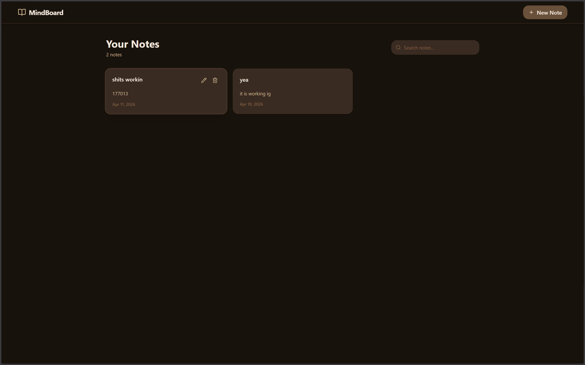
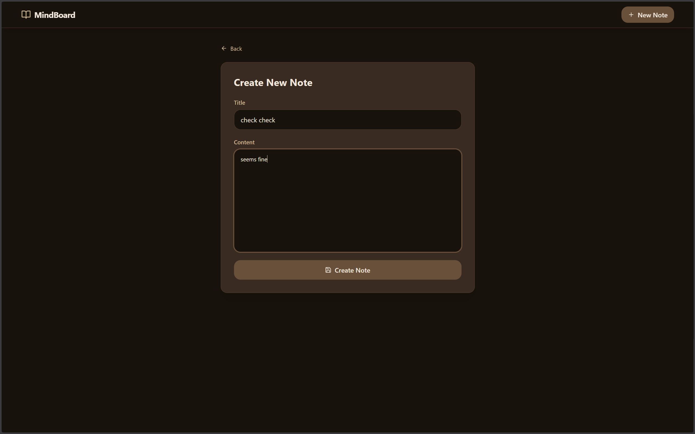
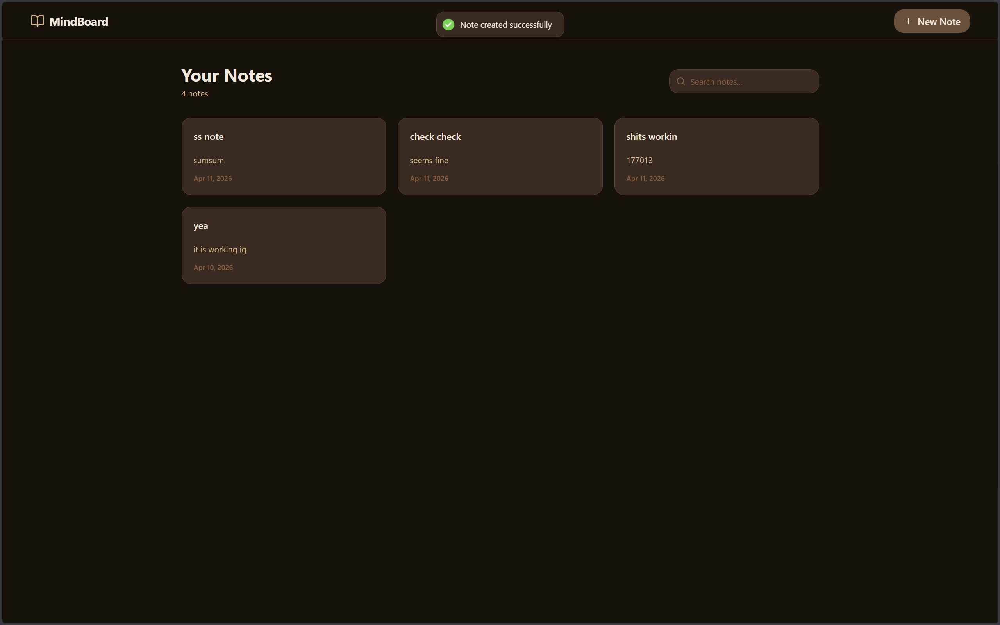

# MindBoard-Notes-WebApp
add notes

# 🧠 MindBoard Notes Web App

A modern full-stack notes application to create, manage, and update your notes efficiently.

---

## 🚀 Features

- 📝 Create notes
- ✏️ Update existing notes
- 🗑️ Delete notes
- 📋 View all notes in a clean UI

---

## 🛠️ Tech Stack

- Frontend: React + TypeScript
- Backend: Node.js + Express
- Database: MongoDB

---

## 📁 Structure
/backend → server  
/frontend → client  

---

## 📸 Preview

### 🏠 Home Page


### ➕ Create Note


### ✅ Updated Home Page


---

## ▶️ Run locally

### Backend
```bash
cd backend
npm install
npm run dev
```

### Frontend
```bash
cd frontend
npm install
npm run dev
```
